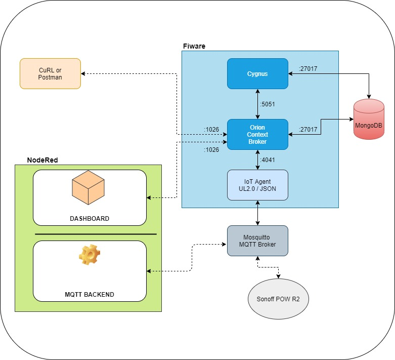

# fiware
project using fiware and tasmota node storing data in mongodb and nodered dashboard  
** DO NOT USE FOR PRODUCTION. **
** THIS IS A COPY OF THE TUTORIAL CONFIGURATION, AND IT DOESN'T START AFTER SHUTDOWN. ONLY AFTER FULL STOP-START **  
## RUN EXAMPLE  
The ip of the server is 192.168.0.150, change it if needed  
```
git clone  
cd json_iot_agent_all_data  
./services start  
docker run -it -p 1880:1880 --restart always -v /opt/nodered:/data --name
nodered nodered/node-red-docker  
## import flows in node red from 'json_iot_agent_all_data/nodered'
```
## Architecture of the setup  
  
The difference between the three setups is the usage of the IoT agent and device attribute configuration.  
* ultralight_iot_agent  
Uses ultralight 2.0 IoT agent. The problem is that when the data is sent over MQTT and stored in mongoDB by CYGNUS, numeric values are stored as strings which is a problem for further filtering.  
* json_iot_agent  
Uses json IoT agent. Values are stored as strings, unless values is sent as an object. Instead of {my_value: 2.0} which will be stored as {my_value: '2.0'}, it is better to use {my_value: {value: 2.0}} which will be stored as sent.  
* json_iot_agent_all_data  
Copy version of JSON IoT Agent. The difference is that I'm sending all of the data received from Sonoff POW R2.  
## Dashboard  
### Tab1  
  
### Tab2  
 